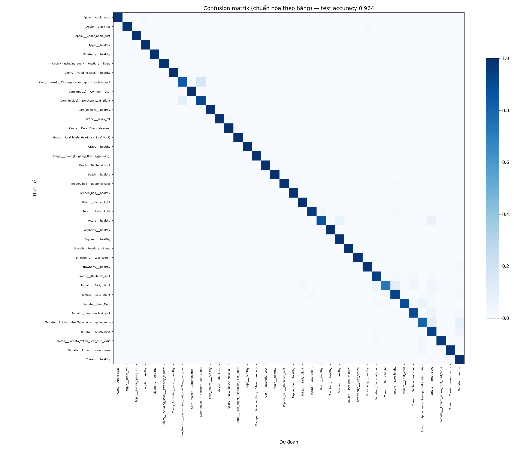
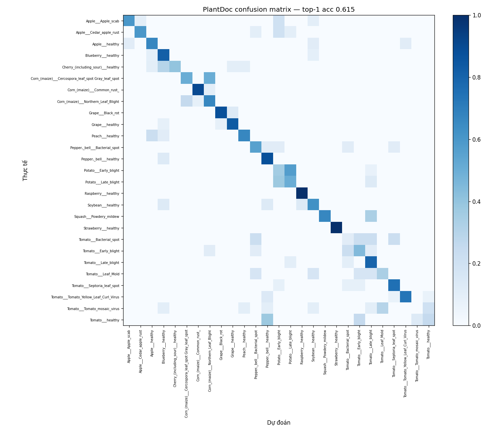

# Plant Disease Detection — phân loại bệnh cây trồng qua ảnh lá

Dự án cá nhân về computer vision: fine-tune một CNN nhẹ để phân loại ảnh lá cây
thành 38 lớp (loại cây × khỏe mạnh / bệnh cụ thể), kèm demo web cho phép upload
ảnh và nhận chẩn đoán + gợi ý xử lý.

**Demo:** _(điền link Hugging Face Space sau khi deploy)_

---

## 1. Vấn đề

Nông dân thường phát hiện bệnh cây muộn, khi triệu chứng đã lan rộng và khó cứu.
Một công cụ chẩn đoán nhanh từ ảnh lá (chụp bằng điện thoại) có thể giúp cảnh báo
sớm. Câu hỏi đặt ra cho dự án này: **một model phân loại ảnh lá train trên dữ liệu
công khai thì thực sự dùng được tới đâu với ảnh chụp thực tế?**

## 2. Dữ liệu

| Bộ | Vai trò | Quy mô | Đặc điểm |
|---|---|---|---|
| **PlantVillage** | train + test chính | 54,305 ảnh, 38 lớp | ảnh chụp trong điều kiện kiểm soát: 1 lá tách rời, nền trơn xám/tím, ánh sáng đều |
| **PlantDoc** | test miền thực tế + fine-tune | ~2,600 ảnh, 27 lớp | ảnh crawl từ web: lá còn trên cây, nền đồng ruộng, nhiều lá, ánh sáng thất thường |

- Mất cân bằng lớp PlantVillage: **36×** (lớp ít nhất `Potato___healthy` 152 ảnh, lớp
  nhiều nhất `Orange___Haunglongbing` 5,507 ảnh) → xử lý bằng `class_weight` khi train
  và luôn đọc F1 theo từng lớp thay vì chỉ accuracy tổng.
- Chia stratified 80/10/10 (train/val/test), giữ nguyên tỉ lệ lớp ở mỗi tập.
- Tên lớp PlantDoc khác PlantVillage nên có bảng quy đổi thủ công
  ([scripts/plantdoc_map.py](scripts/plantdoc_map.py)); PlantDoc chỉ phủ được ~30/38 lớp.

> Ban đầu định lấy PlantVillage qua `tensorflow_datasets` nhưng chuỗi phụ thuộc
> `tensorflow-metadata` / `protobuf` của TFDS xung đột với TensorFlow cài sẵn trên
> Colab (lỗi "Protobuf Gencode/Runtime versions"). Chuyển sang tải trực tiếp từ
> Kaggle (thư mục ảnh thuần) là xong.

## 3. Cách làm

**Transfer learning** thay vì train CNN từ đầu: MobileNetV2 đã học từ ~1.2 triệu ảnh
ImageNet cách nhận cạnh / texture / mảng màu — những "khối xây dựng" thị giác chung.
Ta giữ phần đó, chỉ dạy lại lớp cuối để ánh xạ sang 38 nhãn bệnh. Với ~54k ảnh, cách
này hội tụ sau vài epoch và ít overfit hơn nhiều so với train từ đầu.

Chọn **MobileNetV2** (thay vì ResNet/EfficientNet lớn hơn) vì nhẹ (~3.5M tham số),
train nhanh trên Colab free GPU, và dễ convert sang TFLite cho mục tiêu mobile.

### Bước 3 — train trên PlantVillage ([scripts/step3_train.py](scripts/step3_train.py))

- **Pha 1** — đóng băng toàn bộ MobileNetV2, chỉ train head mới (GlobalAvgPool +
  Dropout 0.2 + Dense 38, softmax). Adam 1e-3.
- **Pha 2** — mở khóa 50 layer cuối, fine-tune với Adam 1e-5.
- `preprocess_input` của MobileNetV2 gắn thẳng trong model (không phải bước rời) để
  export đi demo/TFLite không ai quên. BatchNorm giữ ở chế độ inference kể cả khi
  fine-tune (tránh phá thống kê BN với batch nhỏ).
- EarlyStopping theo `val_loss`, `class_weight` bù mất cân bằng, augmentation
  (flip / rotation / zoom / contrast / brightness) chỉ áp dụng cho tập train.

**Vì sao augmentation quan trọng:** ảnh PlantVillage quá "sạch". Augmentation dạy
model quen với lệch góc, đổi sáng, lật ảnh — các biến thể sẽ gặp ở ảnh thật — dù chỉ
học từ ảnh phòng thí nghiệm.

### Bước 3b — fine-tune sang miền đồng ruộng ([scripts/step3b_finetune_plantdoc.py](scripts/step3b_finetune_plantdoc.py))

Train tiếp model Bước 3 trên PlantDoc train, **trộn kèm ~6,000 ảnh PlantVillage làm
"mỏ neo"** để không quên hẳn miền ảnh sạch (catastrophic forgetting). Augmentation
mạnh hơn (thêm translation, biên độ lớn hơn). Mở khóa 60 layer cuối, Adam 1e-5.

## 4. Kết quả

| Model | PlantVillage test (ảnh sạch) | PlantDoc test — top‑1 | PlantDoc test — top‑3 | PlantDoc macro‑F1 |
|---|---|---|---|---|
| **A** — chỉ PlantVillage | **0.974** | 0.306 | 0.456 | 0.29 |
| **B** — + fine‑tune PlantDoc | 0.945 | **0.615** | **0.845** | **0.60** |



- **Model A trên test set PlantVillage: 97.4%**, macro‑F1 0.971. Gần như mọi lỗi xảy
  ra *giữa các bệnh cùng một loại cây* (cà chua nhầm cà chua, ngô nhầm ngô), chưa bao
  giờ nhầm giữa hai loài khác nhau. Yếu nhất: nhóm đốm lá cà chua
  (`Target_Spot` precision 0.76, `Early_blight` recall 0.85) vì triệu chứng thị giác
  gần giống nhau.
- **Cùng Model A trên ảnh đồng ruộng thật (PlantDoc): rớt còn 30.6%.** Các lớp
  "healthy" sụp về F1 = 0.00 (lá khỏe chụp ngoài trời trông "đủ bệnh"). Model co cụm
  về vài lớp "an toàn". Thử nhanh trên 5 ảnh crawl từ Google Images: **0/5 đúng**,
  với độ tin cậy tới 99.8% cho đáp án sai.
- **Fine-tune (Model B) kéo PlantDoc top‑1 tăng gấp đôi lên 61.5%** (top‑3: 84.5%),
  trong khi PlantVillage chỉ tụt 3 điểm (94.5%). Các lớp "healthy" hồi phục
  (Strawberry healthy 0.00 → 1.00 F1). Đánh đổi: precision nhóm đốm lá cà chua trên
  ảnh sạch giảm nhẹ.



## 5. Hạn chế (đọc kỹ phần này)

- **Dữ liệu train thiên lệch điều kiện chụp.** PlantVillage chụp trong phòng: 1 lá,
  nền trơn, sáng đều. Model học cả những đặc trưng giả (spurious features) gắn với
  bối cảnh chụp chứ không chỉ triệu chứng bệnh — nên rớt mạnh khi rời khỏi điều kiện
  đó. Kể cả sau fine-tune, **top‑1 trên ảnh đồng ruộng mới chỉ ~62%**.
- **Softmax luôn tự tin.** Model không có khái niệm "không chắc" / "ảnh này lạ" —
  luôn ép chọn một lớp với xác suất cao. Demo giảm thiểu bằng cách hiện top‑3 và cảnh
  báo khi xác suất cao nhất < 0.45, nhưng đây không phải giải pháp triệt để.
- **Phạm vi cây trồng hẹp và lệch địa lý.** Chỉ 14 loài, chủ yếu cây trồng ở Mỹ /
  châu Âu (táo, nho, cà chua, khoai tây, ngô…). **Không có lúa** và phần lớn cây trồng
  phổ biến ở Việt Nam. Không thể dùng cho cây ngoài danh sách.
- **PlantDoc nhỏ và nhiễu.** ~2,600 ảnh, nhãn crawl từ web có sai sót, tập test chỉ
  ~9 ảnh/lớp → số liệu per‑class dao động mạnh, nên đọc theo xu hướng.
- **Đây là bài tập cá nhân, không phải công cụ chẩn đoán để dùng thực tế.** Gợi ý xử
  lý bệnh trong demo là kiến thức phổ thông tham khảo, không thay tư vấn bảo vệ thực vật.

## 6. Chạy lại

Toàn bộ bước train/eval chạy trên Google Colab (free GPU). Chi tiết lệnh ở docstring
đầu mỗi script trong [scripts/](scripts/).

```bash
pip install -r requirements.txt

# tải PlantVillage + PlantDoc từ Kaggle vào data/ và plantdoc/ (cần kaggle.json)
python scripts/step1_explore.py            # thống kê + kiểm tra mất cân bằng
python scripts/step2_prepare_data.py       # chia split + class_weight + demo augmentation
python scripts/step3_train.py --save-dir models                          # train PlantVillage
python scripts/step4_evaluate.py --model-path models/mobilenetv2_plantvillage.keras
python scripts/step4b_eval_plantdoc.py --model-path models/mobilenetv2_plantvillage.keras --data-dir plantdoc
python scripts/step3b_finetune_plantdoc.py \
    --base-model models/mobilenetv2_plantvillage.keras \
    --save-path  models/mobilenetv2_pv_plantdoc.keras --plantdoc-dir plantdoc
```

### Chạy demo

```bash
MODEL_PATH=models/mobilenetv2_pv_plantdoc.keras python app.py
```

### Deploy demo lên Hugging Face Spaces

1. Tạo Space mới (SDK: Gradio).
2. Thêm vào đầu `README.md` của Space phần cấu hình:
   ```
   ---
   title: Plant Disease Detection
   sdk: gradio
   app_file: app.py
   ---
   ```
3. Push `app.py`, `requirements.txt`, `outputs/class_names.json`, và file model
   `models/mobilenetv2_pv_plantdoc.keras` (dùng Git LFS) lên Space.

### (Tùy chọn) Convert sang TFLite cho mobile

```python
conv = tf.lite.TFLiteConverter.from_keras_model(
    tf.keras.models.load_model("models/mobilenetv2_pv_plantdoc.keras"))
conv.optimizations = [tf.lite.Optimize.DEFAULT]
open("model.tflite", "wb").write(conv.convert())
```
MobileNetV2 sau khi lượng tử hóa còn ~3-4 MB, chạy được real-time trên điện thoại
tầm trung. Chưa tích hợp app native trong phạm vi dự án này.

## 7. Cấu trúc

```
scripts/
  utils.py                    hàm chung (tìm thư mục ảnh, list file, load class names)
  data_pipeline.py            stratified split, tf.data pipeline, augmentation
  plantdoc_map.py             quy đổi tên lớp PlantDoc -> PlantVillage
  step1_explore.py            thống kê dữ liệu
  step2_prepare_data.py       chia split + class_weight + demo augmentation
  step3_train.py              transfer learning MobileNetV2 (2 pha)
  step3b_finetune_plantdoc.py fine-tune sang miền ảnh đồng ruộng
  step4_evaluate.py           đánh giá trên test set PlantVillage
  step4b_eval_plantdoc.py     đánh giá trên PlantDoc (ảnh thực tế)
  predict.py                  dự đoán top-k cho ảnh bất kỳ
app.py                        demo Gradio
outputs/                      class_names.json + biểu đồ / báo cáo kết quả
```

## 8. Nguồn

- PlantVillage — Hughes & Salathé, 2015. Bản Kaggle: `abdallahalidev/plantvillage-dataset`.
- PlantDoc — Singh et al., 2020. Bản Kaggle: `nirmalsankalana/plantdoc-dataset`.
- MobileNetV2 — Sandler et al., 2018. Trọng số pretrained ImageNet từ `tf.keras.applications`.
